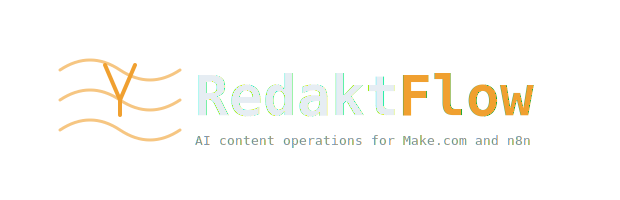

<p align="center">
  
</p>

<h1 align="center">RedaktFlow</h1>
<p align="center">AI content operations engine for Make.com and n8n.</p>

<p align="center">
  <a href="https://github.com/renezander030/redaktflow/stargazers"></a>
  <a href="https://github.com/renezander030/redaktflow/blob/master/LICENSE"></a>
  
  
</p>

RedaktFlow monitors, optimizes, and orchestrates your content automation workflows. It connects to Make.com and n8n, adds AI-powered content drafting and repurposing, and keeps a human in the loop before anything publishes.

**Your workflows run on rules. This adds editorial judgment.**

## Quickstart

```bash
git clone https://github.com/renezander030/redaktflow.git && cd redaktflow
cp secrets.yaml.example secrets.yaml   # add your API keys
go build -o redaktflow . && ./redaktflow
```

Define your pipelines in `config.yaml`, your prompts in `skills/`, and RedaktFlow handles the rest.

## What It Does

| Capability | How it works |
|---|---|
| **Monitor** | Watch Make.com scenarios and n8n workflows for failures, alert with diagnostics |
| **Optimize** | AI analyzes workflow blueprints for redundancy, error handling gaps, cost waste |
| **Draft** | Generate platform-specific content (LinkedIn, Dev.to, Twitter/X, Hashnode) from topics |
| **Repurpose** | Transform content across platforms -- re-angle, don't just resize |
| **Schedule** | AI-planned content calendar across platforms with topic spreading |
| **Approve** | Every piece of content goes through human review before publishing |

## Integrations

| Platform | What RedaktFlow does |
|---|---|
| **Make.com** | List/create/update scenarios, monitor executions, read/write blueprints, trigger runs |
| **n8n** | List/create/update workflows, monitor executions, retry failures, audit nodes |
| **Slack / Telegram** | Operator approval channel (human-in-the-loop) |

Adding a new integration means writing one Go file. Each connector follows the same pattern: fetch data, classify with AI, draft output, get human approval.

## How It Works

RedaktFlow runs pipelines. Each pipeline is a sequence of typed steps:

| Step type | What it does |
|---|---|
| `deterministic` | Plain code: fetch scenarios, check executions, pull workflows |
| `ai` | LLM inference with a skill template, budget-checked |
| `approval` | Human-in-the-loop: operator reviews before proceeding |

Example pipelines:

```yaml
pipelines:
  # Alert on failed Make.com scenarios with AI diagnosis
  - name: scenario-health
    schedule: 1h
    steps:
      - name: check-failures
        type: deterministic
        action: make_failed_executions
        vars:
          scenario_id: "12345"

      - name: diagnose
        type: ai
        skill: optimize-scenario

      - name: alert
        type: deterministic
        action: notify

  # Draft a LinkedIn post from a topic, human approves
  - name: content-draft
    schedule: manual
    steps:
      - name: mock-input
        type: deterministic

      - name: draft
        type: ai
        skill: draft-post

      - name: review
        type: approval
        mode: hitl
        channel: telegram

  # Weekly audit of n8n workflows
  - name: workflow-audit
    schedule: 7d
    steps:
      - name: fetch-workflows
        type: deterministic
        action: n8n_list_workflows

      - name: analyze
        type: ai
        skill: optimize-scenario

      - name: report
        type: deterministic
        action: notify
```

## Governance

Same guardrails as production operations tools:

- **Token budgets** -- per-step, per-pipeline, per-day limits with hard circuit breakers
- **Human-in-the-loop** -- every piece of outbound content requires operator approval
- **Output validation** -- AI output validated against JSON schemas
- **Audit trail** -- full logging of what was drafted, reviewed, and published

## Configuration

### config.yaml

```yaml
make:
  api_key_env: MAKE_API_KEY
  region: eu1
  team_id: 12345

n8n:
  base_url: https://your-n8n.example.com
  api_key_env: N8N_API_KEY

provider:
  type: openrouter
  api_key_env: OPENROUTER_API_KEY
  base_url: https://openrouter.ai/api/v1

budgets:
  per_step_tokens: 2048
  per_pipeline_tokens: 10000
  per_day_tokens: 100000
```

### Skills

YAML prompt templates in `skills/`. Each skill defines the system prompt, input variables, and output schema.

```yaml
# skills/draft-post.yaml
name: draft-post
role: drafter
prompt: |
  Topic: {{topic}}
  Platform: {{platform}}
  Write for practitioners, not beginners...
output_schema:
  title: {type: string}
  body: {type: string}
  platform: {type: string}
```

## Project Structure

```
redaktflow/
  main.go          # Engine: pipeline runner, operator bot, scheduler, guardrails
  make.go          # Make.com integration (scenarios, executions, blueprints)
  n8n.go           # n8n integration (workflows, executions, credentials)
  config.yaml      # Pipelines, models, budgets, timeouts
  secrets.yaml     # Private config (operator IDs) -- gitignored
  skills/          # Prompt templates with schema validation
    draft-post.yaml
    repurpose-content.yaml
    optimize-scenario.yaml
    schedule-content.yaml
```

## Star History

If RedaktFlow is useful to you, consider giving it a star. It helps others discover the project.

[](https://star-history.com/#renezander030/redaktflow&Date)

## License

MIT. See [LICENSE](LICENSE).
